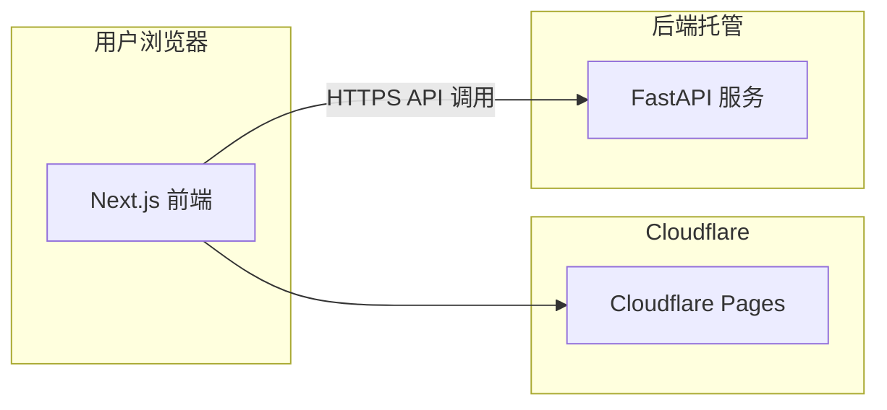

# MPChat 迁移计划：Next.js 前端 + Python API + Cloudflare 部署

本文档描述如何将现有 Streamlit 应用拆分为「前端 (Next.js) + 后端 (Python API)」，前端部署在 Cloudflare Pages（免费、UI 不受限），后端部署在 Railway / Render 等免费或低成本平台。

---

## 1. 目标架构



- **前端**：Next.js（React），完全自定义 UI（Apple HIG / 任意设计系统），部署在 **Cloudflare Pages**，免费。
- **后端**：现有 Python 逻辑封装为 **FastAPI** HTTP API，部署在 **Railway** 或 **Render** 免费档（或保留 Streamlit Cloud 仅作 API 用途需自行改造）。
- **数据流**：浏览器只与 Next.js 交互；Next.js 在服务端或客户端请求 Python API，完成生成、分析、分发等。

---

## 2. 后端：Python API 设计

### 2.1 技术选型

- **框架**：FastAPI（异步友好、自动 OpenAPI 文档、与现有 async/await 兼容）。
- **位置**：新建目录 `api/`，业务逻辑存放在 `core/` 包中（`core/scenarios.py`、`core/seo_tools.py` 等）；API 层只做 HTTP 入参/出参，调用 `core.*` 模块。

### 2.2 需要暴露的 API 端点（从 app.py 反推）

| 端点 | 方法 | 用途 | 对应现有逻辑 |
|------|------|------|----------------|
| `/api/v1/config/providers` | GET | 获取 AI 服务商列表 | PROVIDERS 字典 |
| `/api/v1/config/scenarios` | GET | 场景分类、卖点、文风、语言、关键词预设 | scenarios.py |
| `/api/v1/knowledge/web` | POST | 抓取网络知识库（可选 SERP） | fetch_web_knowledge, analyze_serp |
| `/api/v1/generate` | POST | 生成单篇文章（含可选配图） | generate_article, fetch_images_for_article |
| `/api/v1/analyze/seo` | POST | 对给定正文做 SEO 评分与明细 | reading_stats, _render_seo_breakdown |
| `/api/v1/analyze/geo` | POST | 对给定正文做 GEO 评分与明细 | geo_score, _render_geo_breakdown |
| `/api/v1/optimize` | POST | 一键优化（SEO / GEO / 双优化 / 三合一） | _optimize_article, build_*_prompt |
| `/api/v1/external/analyze` | POST | 外部文章分析（SEO+GEO+AI 检测） | 外部文章 Tab 逻辑 |
| `/api/v1/external/optimize` | POST | 外部文章优化（SEO/GEO/双优化/三合一） | _ext_run_optimize |
| `/api/v1/publish/*` | POST | 各平台分发（Dev.to、Hashnode、格式导出等） | publishers.py |
| `/api/v1/schema` | POST | 生成 JSON-LD / FAQ Schema | generate_schema, generate_faq_schema |
| `/api/v1/slug` | POST | 生成 URL Slug | generate_slug |
| `/api/v1/links` | POST | 生成内链建议 | generate_internal_links |
| `/api/v1/detect/ai` | POST | AI 内容检测（返回 AI 概率和痕迹分析） | AI detection logic in app.py |
| `/api/v1/generate/batch` | POST | 批量生成（多场景并发，返回 task_id） | 批量生成逻辑 |
| `/api/v1/generate/stream` | GET (SSE) | 流式生成（Server-Sent Events，实时推送生成进度和内容片段） | generate_article + SSE |
| `/api/v1/serp/analyze` | POST | SERP 竞品分析（独立于知识库抓取） | analyze_serp in serp_analyzer.py |
| `/api/v1/images/search` | POST | 独立图片搜索（供 Module C 和编辑器使用） | fetch_images_for_article in image_client.py |

请求/响应体使用 JSON。文件上传（若需要）可用 multipart/form-data。

#### `/api/v1/generate` 请求/响应示例

**请求：**

```json
{
  "provider": "openai",
  "model": "gpt-4o",
  "api_key": "sk-xxx",
  "language": "中文",
  "category": "数字货币",
  "scenario": "比特币入门指南",
  "style": "专业严谨",
  "keywords": "比特币, BTC, 加密货币",
  "selling_points": ["安全性", "去中心化"],
  "include_images": true,
  "image_count": 3
}
```

**成功响应（200）：**

```json
{
  "article": "# 比特币入门指南\n\n## 什么是比特币？\n\n比特币（Bitcoin, BTC）是一种...",
  "title": "比特币入门指南：从零开始理解去中心化数字货币",
  "meta_description": "了解比特币基础知识，从概念到使用场景的完整指南...",
  "slug": "bitcoin-beginner-guide-2026",
  "ab_titles": [
    "2026 比特币新手必读：5 分钟搞懂去中心化货币",
    "比特币是什么？一篇文章讲透加密货币入门",
    "从零学比特币：安全、去中心化与投资入门"
  ],
  "images": [
    {
      "url": "https://pixabay.com/...",
      "alt": "Bitcoin cryptocurrency digital",
      "source": "pixabay"
    }
  ],
  "word_count": 2450,
  "reading_time_min": 8,
  "faq_pairs": [
    { "q": "比特币安全吗？", "a": "比特币使用区块链技术..." }
  ]
}
```

**错误响应（422）：**

```json
{
  "detail": [
    {
      "loc": ["body", "api_key"],
      "msg": "field required",
      "type": "value_error.missing"
    }
  ]
}
```

#### `/api/v1/analyze/seo` 请求/响应示例

**请求：**

```json
{
  "article": "# 比特币入门指南\n\n## 什么是比特币？...",
  "keywords": "比特币, BTC, 加密货币",
  "target_url": "https://mp.net/blog/bitcoin-guide"
}
```

**成功响应（200）：**

```json
{
  "score": 82,
  "word_count": 2450,
  "reading_time_min": 8,
  "h2_count": 6,
  "keyword_density": {
    "比特币": 2.3,
    "BTC": 1.1,
    "加密货币": 0.8
  },
  "breakdown": {
    "title_has_keyword": true,
    "meta_description_length": 156,
    "h2_contains_keyword": true,
    "image_alt_has_keyword": false,
    "internal_links_count": 0,
    "external_links_count": 2
  },
  "suggestions": [
    "建议在至少 1 张图片的 alt 属性中包含目标关键词",
    "建议添加 2-3 个指向 mp.net 其他页面的内链"
  ]
}
```

### 2.3 环境变量与安全

- API 所需环境变量与当前 `.env` 一致（如 `OPENAI_API_KEY`、`PIXABAY_API_KEY`、各分发平台的 Key 等），由部署平台注入。
- 若前端直接调用后端（同域或跨域），需在 FastAPI 中配置 CORS，允许 Cloudflare Pages 的域名（如 `https://xxx.pages.dev`）和本地开发域名（`http://localhost:3000`）。

---

## 3. 前端：Next.js 应用结构

### 3.1 技术选型

- **框架**：Next.js 14+（App Router 或 Pages Router 二选一，建议 App Router）。
- **样式**：Tailwind CSS + 自定义 CSS 变量（与 [DESIGN_SYSTEM.md](DESIGN_SYSTEM.md) 一致）。
- **状态**：React 状态 + 可选 React Query / SWR 请求 API 并缓存。
- **部署**：构建为静态导出（`output: 'export'`）或使用 Cloudflare Next.js 适配器，部署到 Cloudflare Pages。

### 3.2 页面与路由（对应现有 3 Tab + 输出区）

- **`/` 或 `/workspace`**：创作工作台  
  - 配置条（语言、场景分类、具体场景、文风、关键词、批量模式开关）、高级设置折叠（卖点、关键词预设）、生成按钮、批量生成 UI。  
  - 生成后：评分条（SEO/GEO）+ 一键优化入口 + 4 个子 Tab（文章预览、SEO 分析、GEO 分析、分发）。  
  - 文章预览：SEO 元数据、正文、配图。  
  - SEO 分析：Schema、内链、SEO 评分明细、SERP 结果内嵌。  
  - GEO 分析：GEO 评分、双优化、AI 检测与人性化。  
  - 分发：Dev.to / Hashnode / Medium / LinkedIn / Twitter / 知乎 / 公众号 / 加密博客 等。

- **`/external`**：外部文章优化  
  - 粘贴文章、目标关键词、开始分析、SEO/GEO/双优化/AI 检测 Tab、优化结果与对比。

- **`/history`**：生成历史  
  - 历史列表、加载、清空。

- 可增加 **`/api/...`** 作为 Next.js 内部代理（可选），将前端请求转发到 Python 后端，便于统一域名与避免 CORS。

### 3.3 UI 规范

- 直接沿用或扩展 [DESIGN_SYSTEM.md](DESIGN_SYSTEM.md) 的 Apple HIG 风格（毛玻璃、平滑圆角、SF Pro、分段控制器、Pill 按钮、Focus Ring）。  
- 将设计规范沉淀到 [DESIGN_SYSTEM.md](DESIGN_SYSTEM.md)，便于后续迭代一致。

---

## 4. 部署步骤

### 4.1 后端（FastAPI）

1. 在项目根目录下新建 `api/`，内含 `main.py`（FastAPI app）、`routers/`（按模块拆分子路由）、依赖 `fastapi`、`uvicorn` 等。
2. 复用 `core/` 包中的模块（`core.scenarios`、`core.seo_tools`、`core.geo_tools`、`core.publishers`、`core.image_client`、`core.serp_analyzer`）及 app.py 中的纯函数（如 `generate_article`、`reading_stats`、`geo_score` 等），不在 API 内重复实现业务。
3. 在 Railway 或 Render 上创建新服务，根目录设为项目根，启动命令为 `uvicorn api.main:app --host 0.0.0.0 --port $PORT`。
4. 在平台中配置环境变量（与当前 `.env` 一致），并拿到后端公网 URL（如 `https://mpchat-api.railway.app`）。

### 4.2 前端（Next.js）

1. 在项目根目录下新建 `frontend/`（或与仓库并列的 `mpchat-frontend` 仓库），使用 `create-next-app` 初始化，安装 Tailwind、SWR/React Query 等。
2. 在 frontend 中配置「后端 API 基地址」（如 `NEXT_PUBLIC_API_URL=https://mpchat-api.railway.app`），所有请求发往该基地址。
3. 实现上述页面与组件，调用后端 API 完成配置、生成、分析、优化、分发、历史等流程。
4. 使用 Cloudflare Pages 连接 Git 仓库，构建命令为 `cd frontend && npm ci && npm run build`，输出目录为 `frontend/out`（静态导出）或 `frontend/.next`（若用 Cloudflare Next 适配器）。  
5. 若后端与前端不同域，在 FastAPI 中设置 CORS 允许 Cloudflare Pages 的域名和 `localhost:3000`。

### 4.3 环境变量汇总

- **后端**：现有 `.env` 中的所有 Key（OpenAI/Gemini、Pixabay、Pexels、Dev.to、Hashnode、SERP 等）。
- **前端**：`NEXT_PUBLIC_API_URL`（必填），其余按需（如 analytics）。

---

## 5. 执行顺序建议

1. **Phase 1：后端 API**  
   - 新建 `api/`，实现 FastAPI app 与 CORS。  
   - 实现 `/api/v1/config/providers`、`/api/v1/config/scenarios`、`/api/v1/generate`、`/api/v1/analyze/seo`、`/api/v1/analyze/geo` 等核心端点，用 Postman 或 curl 自测。  
   - 部署到 Railway 或 Render，确认外网可访问。

2. **Phase 2：前端骨架**  
   - 新建 `frontend/`，Next.js + Tailwind，接入 DESIGN_SYSTEM.md 的样式。  
   - 实现创作工作台单页：配置条、生成按钮、调用 `/api/v1/generate`，展示返回结果（文章预览 + 评分）。  
   - 本地通过 `NEXT_PUBLIC_API_URL` 指向本地或已部署后端，联调通过。

3. **Phase 3：前端完整功能**  
   - 实现 4 个子 Tab（预览、SEO、GEO、分发）、外部文章页、历史页。  
   - 一键优化、SERP 内嵌、批量生成、各平台分发等，全部走 API。

4. **Phase 4：部署与收尾**  
   - 前端部署到 Cloudflare Pages，配置生产环境 `NEXT_PUBLIC_API_URL`。  
   - 后端 CORS 包含 Pages 域名，做一次端到端测试。  
   - 更新 PRD.md 与 README，注明新架构与部署方式。

---

## 6. 与现有文档的关系

- **PRD.md**：保留，继续描述产品目标、功能、用户；不涉及技术栈细节时可维持现状，仅在「开发工具 / 架构」处补充「前端 Next.js + 后端 FastAPI」。
- **DESIGN_SYSTEM.md**：新建或更新，记录 Apple HIG（或最终采用的）视觉规范，供 Next.js 前端统一使用。
- **本文档 (MIGRATION_PLAN.md)**：仅描述迁移步骤与架构，迁移完成后可作为历史参考保留。

---

## 7. API 设计补充

### 7.1 API 版本化

所有端点使用 `/api/v1/` 前缀，为未来升级预留空间：

```
/api/v1/generate
/api/v1/analyze/seo
/api/v1/config/providers
...
```

当需要不兼容改动时，新增 `/api/v2/` 而不影响现有客户端。v1 路由在 `api/routers/` 中通过 `APIRouter(prefix="/api/v1")` 实现。

### 7.2 API 认证

后端部署到公网后需要基本的访问控制，防止未授权调用：

| 方案 | 实现 | 说明 |
|------|------|------|
| **X-API-Key header** | 后端环境变量 `MPCHAT_API_KEY`，前端在 `.env.local` 配置同一 Key | 简单有效，适合内部工具 |
| 中间件校验 | FastAPI `Depends()` 注入，校验 header | 所有端点统一拦截 |
| 跳过策略 | `MPCHAT_API_KEY` 未设置时跳过校验（本地开发免配） | 开发体验友好 |

```python
# api/deps.py
from fastapi import Header, HTTPException
import os

EXPECTED_KEY = os.getenv("MPCHAT_API_KEY")

async def verify_api_key(x_api_key: str = Header(default=None)):
    if EXPECTED_KEY and x_api_key != EXPECTED_KEY:
        raise HTTPException(status_code=401, detail="Invalid API key")
```

### 7.3 流式响应（SSE）

LLM 生成通常需要 30-60 秒，使用 Server-Sent Events 提供实时反馈：

```python
# api/routers/generate.py
from fastapi.responses import StreamingResponse

@router.get("/api/v1/generate/stream")
async def generate_stream(task_id: str):
    async def event_generator():
        yield f"data: {json.dumps({'status': 'generating', 'progress': 0})}\n\n"
        # ... LLM 生成过程中逐步推送
        yield f"data: {json.dumps({'status': 'scoring', 'progress': 80})}\n\n"
        yield f"data: {json.dumps({'status': 'done', 'result': {...}})}\n\n"
    return StreamingResponse(event_generator(), media_type="text/event-stream")
```

前端使用 `EventSource` 或 `fetch` + `ReadableStream` 消费：

```typescript
const es = new EventSource(`${API_BASE}/api/v1/generate/stream?task_id=${id}`);
es.onmessage = (e) => {
  const data = JSON.parse(e.data);
  setProgress(data.progress);
  if (data.status === "done") { setResult(data.result); es.close(); }
};
```

### 7.4 Generate 响应策略

`/api/v1/generate` 响应**不自动包含** SEO/GEO 评分（避免增加响应时间）。前端在收到文章后，并行调用 `/api/v1/analyze/seo` 和 `/api/v1/analyze/geo` 分别获取评分。

修正后的 Generate 响应：

```json
{
  "article": "# 标题\n\n正文...",
  "title": "SEO 标题",
  "meta_description": "SEO 描述",
  "slug": "url-slug",
  "ab_titles": ["备选标题1", "备选标题2", "备选标题3"],
  "images": [...],
  "faq_pairs": [...],
  "word_count": 2450,
  "reading_time_min": 8
}
```

前端收到后同时发起：
1. `POST /api/v1/analyze/seo` → 获取 SEO 评分
2. `POST /api/v1/analyze/geo` → 获取 GEO 评分

---

## 8. 风险与注意点

| 风险 | 影响 | 缓解措施 |
|------|------|----------|
| **冷启动与超时** | Railway/Render 免费档有 ~30s 冷启动和请求超时限制，长时间生成（如 60s）可能超时 | 改为异步任务：POST 返回 `task_id`，前端轮询 `GET /api/v1/task/{id}` 获取结果；或使用 SSE 流式传输 |
| **API Key 安全** | 前端暴露 Key 可被恶意使用 | 所有 Key 仅存后端环境变量；用户自带 Key 通过后端代理请求 LLM，后端不落盘用户 Key |
| **历史与状态** | Streamlit `session_state` 迁移后不可用 | 前端用 `localStorage` 存历史记录（最近 50 条）；考虑后续加 SQLite / KV 持久化 |
| **批量生成并发** | 批量模式同时请求多个 LLM 调用，可能触发 API 速率限制或后端内存不足 | 后端使用 `asyncio.Semaphore(3)` 限制并发数；失败自动重试 1 次；前端展示逐条生成进度 |
| **Cloudflare Pages 构建限制** | 免费额度 500 次/月构建（每次 push 触发） | 开发期只在 `dev` 分支频繁 push，`main` 仅 PR 合并时触发；或使用 `wrangler pages deploy` 手动部署绕过限制 |
| **CORS 配置错误** | 前端请求被浏览器拦截 | FastAPI 明确配置 `allow_origins`，开发时包含 `localhost:3000`，生产时包含 `*.pages.dev` 和自定义域名 |
| **LLM 响应不稳定** | 返回非 JSON、截断、格式异常 | 后端做多策略兜底解析（直接 JSON → 修复尾逗号 → 正则提取 → 纯文本降级），与 v4.x `_parse_opt_result` 逻辑一致 |

完成上述步骤后，MPChat 将以前后端分离方式运行，前端 UI/UX 不再受 Streamlit 限制，并可免费部署在 Cloudflare Pages。
